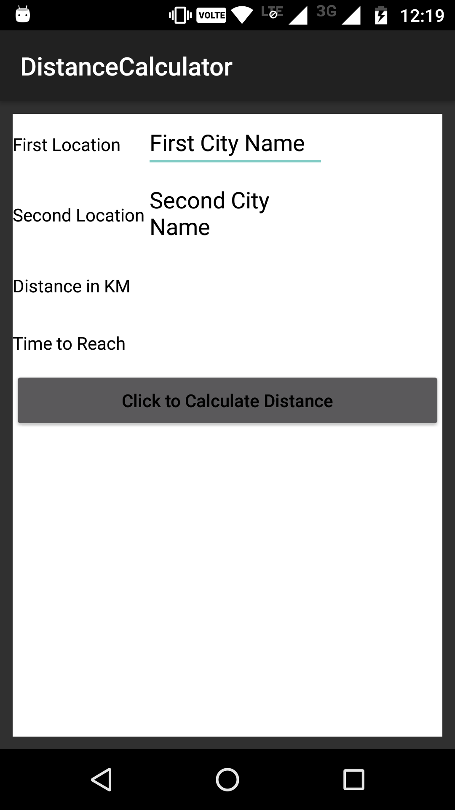
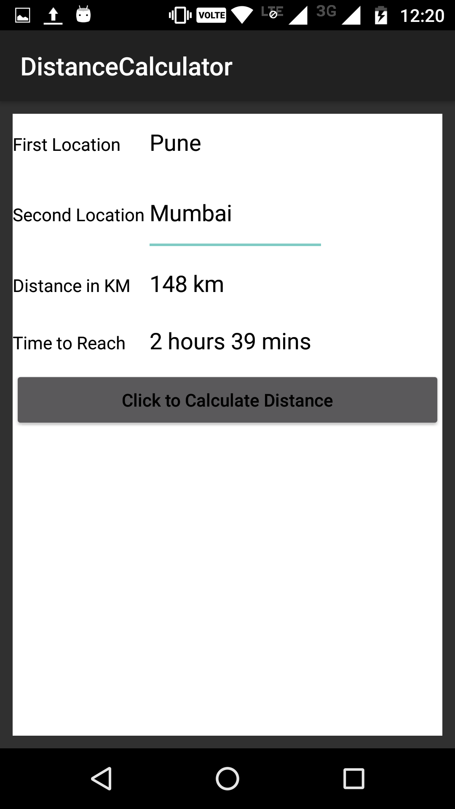

# DistanceCalculatorUsingMaps
Application to calculate distance between two cities. It uses google maps api to calculate distance and approx travel time.

 &nbsp; &nbsp;  &nbsp; &nbsp; &nbsp; &nbsp; 
 

